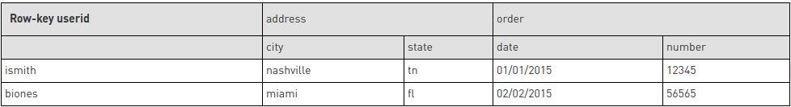

# hbase-shell-command-test

structure we aim to archieve

create table

    create 'customer', {NAME=>'addr'}, {NAME=>'order'}

view table

    describe 'customer'

add data

    put 'customer', 'jsmith', 'addr:city', 'nashville'

view jsmith

    get 'customer', 'jsmith'

add some more data

    put 'customer',  'jsmith',  'addr:state', 'TN'
    put 'customer',  'jsmith',  'order:numb', '1234'
    put 'customer',  'jsmith',  'order:date', '10-18-2014'

view jsmith

    get 'customer', 'jsmith'

get all data from a single column family

    get 'customer', 'jsmith', {COLUMNS=>['addr']}

get single cell

    get 'customer', 'jsmith', {COLUMNS=>['order:numb']}

alter table to store more versions of a column family

    alter 'customer' , NAME => 'order', VERSIONS => 5
    describe 'customer'

add more data

    put 'customer',  'jsmith',  'order:numb', '1235'
    put 'customer',  'jsmith',  'order:numb', '1236'
    put 'customer',  'jsmith',  'order:numb', '1237'
    put 'customer',  'jsmith',  'order:numb', '1238'

get order number

    get 'customer', 'jsmith', {COLUMNS=>['order:numb']}

get more versions

    get 'customer', 'jsmith', {COLUMNS=>['order:numb'], VERSIONS => 5}

add more data

    put 'customer',  'njones',  'addr:city', 'miami'
    put 'customer',  'njones',  'addr:state', 'FL'
    put 'customer',  'njones',  'order:numb', '5555'
    put 'customer',  'tsimmons',  'addr:city', 'dallas'
    put 'customer',  'tsimmons',  'addr:state', 'TX'
    put 'customer',  'jsmith',  'addr:city', 'denver'
    put 'customer',  'jsmith',  'addr:state', 'CO'
    put 'customer',  'jsmith',  'order:numb', '6666'
    put 'customer',  'njones',  'addr:state', 'TX'
    put 'customer',  'amiller', 'addr:state', 'TX'

get all customers

    scan 'customer'

get customer in a range

    scan 'customer', { STARTROW => 'j', STOPROW => 't'}

count customers

    count 'customer'

delete column

    delete 'customer', 'njones', 'addr:city'

delete whole row

    deleteall 'customer', 'jsmith'